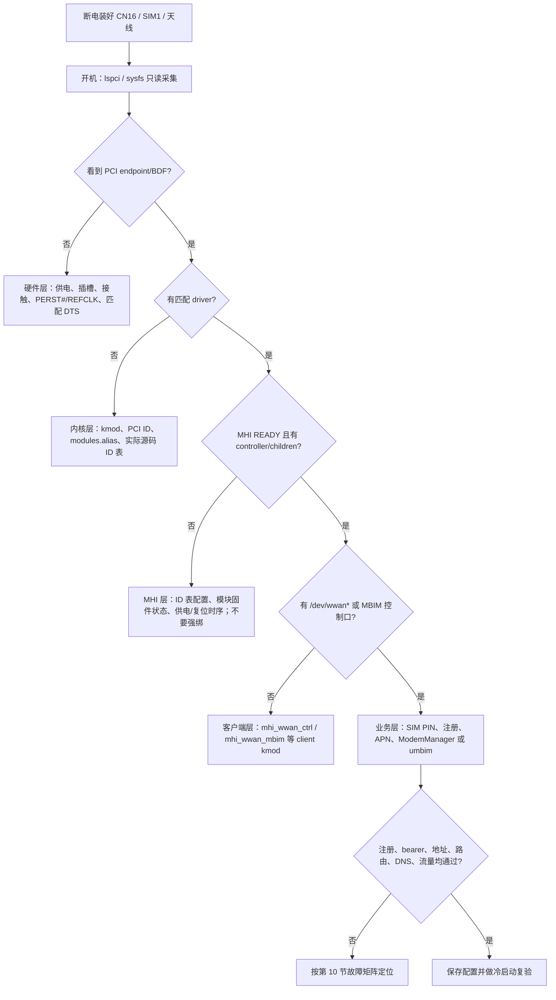

# BPI-R4 + DW5934e：OpenWrt 识别、驱动与 MBIM 拨号部署指南

> **适用对象：** 第一次在 Banana Pi BPI-R4 上安装 **PCIe/MHI** 形态 DW5934e 的客户。  
> **资料基线：** 2026-08-29；命令按 OpenWrt 的 BusyBox shell 编写。先以路由器上实际运行的 OpenWrt 版本、内核版本和软件源为准。  
> **阅读顺序：** 不要一开始就“强绑驱动”或刷写任何东西。先完成 [第 3 节](#3-第一次开机先做只读基线采集)，按 [第 2 节](#2-五层快速决策图先定位再处理) 的层次推进；只有在某层明确失败后才执行对应的下一步。

---

## 1. 范围、前提与明确不包含的内容

本文件只说明下列链路：

```text
BPI-R4 CN16（M.2 Key-B） → PCIe endpoint → Linux MHI → WWAN/MBIM 控制口
→ SIM 注册 → APN 建立数据会话 → OpenWrt WAN → 实际访问互联网
```

### 1.1 BPI-R4 端的已知边界

- BPI-R4 的 **CN16** 是 M.2 Key-B 插槽；官方资料将其列为 `USB 3.2 / PCIe 3.0` 接口，SIM 使用 **SIM1**。安装前请对照 BPI-R4 官方页面和本机板卡丝印确认插槽，避免把模块装到不对应的 M.2 槽位。
- BPI 的公开资料说明 cellular PCIe 的可行性属于接口能力说明；并**没有**给出可泛化的“所有蜂窝 PCIe 卡均已实测”的保证。把 DW5934e 作为 PCIe/MHI endpoint 使用前，必须先实机确认 PCI 枚举和 MHI READY。
- 当前公开资料未能可靠确认 CN16 的实际可用电流、`PERST#`、`CLKREQ#`、`W_DISABLE#` 分别连接到哪个 GPIO 或由哪个电源时序控制。**本指南不猜测 GPIO，也不提供修改 DTS 的 GPIO 数值。** 若 `lspci` 完全没有 endpoint，请优先向板卡/模块供应方索取与板卡版本匹配的原理图、DTS/DTBO 和供电时序资料。

### 1.2 本文件不做什么

以下内容不属于“让 OpenWrt 识别并拨号”的正常部署路径，本文不提供操作步骤：

- FCC 解锁、地区/射频限制绕过；
- EDL/9008、fastboot 或任何固件刷写、恢复、降级；
- `trigger_edl`、`soc_reset` 等设备复位/下载模式触发；
- 把 Ubuntu、Windows、厂商 SDK 或另一版 OpenWrt 的 `.ko` 复制到当前系统；
- 使用 `new_id`、`driver_override`、bind/unbind 强行把设备交给某个驱动。

> **安全和可恢复性原则：** 本文先给只读观察命令。配置或拨号命令都会标为“会改变状态”，并给出可回退的配置方式。对用户无法确认的硬件或固件状态，不使用“万能修复”。

---

## 2. 五层快速决策图：先定位，再处理



| 观察到的现象 | 说明 | 此时应处理的层 | 不应做的事 |
|---|---|---|---|
| `lspci` / `/sys/bus/pci/devices` 没有模块 endpoint | 主机尚未枚举到 PCIe 设备 | 模块插装、供电、复位、参考时钟、匹配 DTS | 安装/强绑 MHI 驱动、改 PCI ID |
| 有 BDF 和 PCI ID，但 `driver` 为空 | PCIe 枚举已成功；驱动不匹配或未安装 | 软件源、kmod ABI、`modules.alias`、实际 ID 表 | 直接把另一内核的 `.ko` 复制进来 |
| driver 已绑定，只有 BHI 或日志没有 `READY` | PCI ID 匹配不代表 modem 已进入 MHI mission mode | MHI 配置、模块实际固件状态、板级电源/复位时序 | `new_id`、`driver_override`、触发 EDL |
| 有 MHI controller/children，但无 `/dev/wwan0mbim0` / `wwanN` | MHI 总线工作，但 MBIM client driver 尚未产生接口 | `kmod-mhi-wwan-ctrl`、`kmod-mhi-wwan-mbim`、`kmod-wwan` | 先配 APN 或用 LuCI 猜端口 |
| 有控制口/网络接口却不能上网 | 内核识别已完成；问题在 SIM、注册、APN、认证、路由/DNS | ModemManager；仅在主机 DHCP 已实机交付 cellular DNS 时使用 umbim | 同时让 ModemManager 和 umbim 控制同一 modem |

---

## 3. 第一次开机：先做只读基线采集

### 3.1 断电硬件准备（不要带电插拔）

1. **关闭 BPI-R4 电源并断开适配器。** M.2 卡不是热插拔部署对象。
2. 将 DW5934e 安装到 **CN16 M.2 Key-B**，确认金手指完全插到底，再以螺丝固定，避免天线线或散热片顶起模块。
3. 将已开通数据业务的 nano-SIM 装入 **SIM1**，记录 SIM PIN（若运营商启用了 PIN）。请勿把 PIN、ICCID、IMSI、IMEI 写入工单截图或公开日志。
4. 连接主/分集天线并固定。没有合规天线或连接松动时，即使 PCIe 已识别，也可能无法注册网络。
5. 使用足够规格、稳定的板级电源。没有公开的 CN16 可用电流上限时，不以“普通 M.2 SSD 能工作”推断蜂窝模块供电一定足够。
6. 再开机；第一次不要修改 `/sys`、不要刷写、不要 reset 模块。

### 3.2 一次复制的只读采集命令

以下代码**只读取**状态；不写 sysfs、不装包、不连接网络。若系统没有 `lspci`，命令会继续执行并显示提示。

```sh
echo '===== A. 系统 ====='
date
uname -a
ubus call system board
cat /etc/openwrt_release 2>/dev/null || true
opkg status kernel 2>/dev/null | sed -n '1,40p'

echo '===== B. PCI 枚举 ====='
command -v lspci >/dev/null && lspci -nnk || echo '未安装 pciutils/lspci：仍可查看下面的 sysfs 项'
for d in /sys/bus/pci/devices/*; do
        [ -e "$d/vendor" ] || continue
        printf '\n%s\n' "$d"
        printf '  vendor:device = '; cat "$d/vendor" "$d/device" 2>/dev/null | tr '\n' ' '; echo
        printf '  subsystem     = '; cat "$d/subsystem_vendor" "$d/subsystem_device" 2>/dev/null | tr '\n' ' '; echo
        printf '  modalias      = '; cat "$d/modalias" 2>/dev/null || true
        printf '  driver        = '; readlink -f "$d/driver" 2>/dev/null || echo '(未绑定)'
        printf '  power_state   = '; cat "$d/power_state" 2>/dev/null || true
done

echo '===== C. 驱动、MHI、WWAN ====='
lsmod | grep -Ei '(^|_)(mhi|wwan|qrtr)' || true
find /sys/bus/mhi/devices -maxdepth 2 -print 2>/dev/null || true
find /sys/class/mhi -maxdepth 3 -print 2>/dev/null || true
find /sys/class/wwan -maxdepth 3 -print 2>/dev/null || true
ls -l /dev/wwan* /dev/cdc-wdm* /dev/mhi_* 2>/dev/null || true
ip -br link

echo '===== D. 最近内核日志 ====='
dmesg | grep -Ei 'pci|pcie|mhi|wwan|mbim|qrtr|qmi|foxconn' | tail -n 250
```

将输出保存到本地文本文件；回传时请删除序列号、IMEI、ICCID、IMSI、手机号、APN 用户名和密码。

---

## 4. PCI ID 到 MHI 驱动：必须理解的匹配链

### 4.1 本项目会遇到的 ID

下表是用于**识别和审计**的 PCI ID 解释，不是要求手工伪造或改写 ID：

| PCI vendor:device | 含义/上游命名 | 部署含义 |
|---|---|---|
| `105b:e11d` | Foxconn **DW5934e eSIM** 变体 | 上游 SDX72 Foxconn 支持项之一；检查实际 kernel source 是否含该表项 |
| `105b:e11e` | Foxconn **DW5934e non-eSIM** 变体 | 同上，不能因为名称相近而假定 `e11d` 的配置必然适用 |
| `105b:e118` | Foxconn **T99W640** | 与 DW5934e 不同 SKU；上游后续修正了其名称匹配 |
| `17cb:0309` | Qualcomm SDX75 generic 路径 | 即便 PCI subsystem 显示 `105b:e11d`，它也**不是**上游的 DW5934e 专项 PCI 映射；不要覆盖 generic 绑定，除非有 OEM 资料、完整实机证据和内核评审 |

### 4.2 Linux 为什么能“识别”一张 PCIe 卡

PCIe 配置空间中：

- `vendor` / `device` 是 endpoint 的主 ID（`/sys/bus/pci/devices/<BDF>/vendor`、`device`）；
- `subsystem_vendor` / `subsystem_device` 是板级/OEM 子系统 ID；
- 内核从这些字段生成 `modalias`，类似 `pci:v0000105Bd0000E11D...`；
- 已安装内核模块会在 `/lib/modules/$(uname -r)/modules.alias` 内发布它支持的 alias；modprobe 由 alias 寻找候选模块；
- 模块的 PCI ID 表最终决定 probe 时采用哪一份设备配置。

可以只读核对（替换为实际 BDF 和实际内核版本）：

```sh
BDF='0000:01:00.0'                 # 示例；必须替换为 lspci 实际显示的 BDF
cat "/sys/bus/pci/devices/$BDF/modalias"
readlink -f "/sys/bus/pci/devices/$BDF/driver" 2>/dev/null || true
grep -Ei '105B.*(E11D|E11E|E118)|17CB.*0309' \
  "/lib/modules/$(uname -r)/modules.alias" 2>/dev/null || true
```

### 4.3 为什么不能用 `new_id` / `driver_override` “试一试”

`mhi_pci_generic` 的 PCI 表不仅是“vendor/device 白名单”。其 `pci_device_id.driver_data` 指向相应的 `mhi_pci_dev_info`（含 MHI controller 配置、固件/名称等信息），probe 会使用这一信息。仅动态添加一个 ID 并不能提供正确的设备配置，可能导致错误 probe、异常状态或隐藏真正的供电/固件问题。

因此本指南**禁止**将 `new_id`、`driver_override`、手工 bind/unbind 当作诊断或部署步骤。看到 driver 已绑定但 MHI 不 READY 时，应回到第 2 节的 MHI/硬件层，而非强迫另一个 driver 接管。

上游实现可审阅：[
`drivers/bus/mhi/host/pci_generic.c`](https://github.com/torvalds/linux/blob/master/drivers/bus/mhi/host/pci_generic.c)。

---

## 5. 驱动与用户态资料清单

### 5.1 必需或常用的 OpenWrt kmod

包名会随 OpenWrt 分支而变化；先用 `opkg list | grep` 或在自编译 `.config` 中确认。下表给出职责与对应 Kconfig，**Kconfig 是内核能力名，不等于任何固件一定已编出同名 ipk**。

| OpenWrt kmod（通常名称） | 关键 Kconfig | 作用 | 是否通常需要 |
|---|---|---|---|
| `kmod-mhi-bus` | `CONFIG_MHI_BUS` | MHI host bus 核心 | 是 |
| `kmod-mhi-pci-generic` | `CONFIG_MHI_BUS_PCI_GENERIC` | PCIe MHI host/generic PCI ID 表 | 是 |
| `kmod-wwan` | `CONFIG_WWAN` | WWAN 核心 | 是 |
| `kmod-mhi-wwan-ctrl` | `CONFIG_MHI_WWAN_CTRL` | MHI WWAN 控制设备 | 是 |
| `kmod-mhi-wwan-mbim` | `CONFIG_MHI_WWAN_MBIM` | MHI MBIM 控制口/数据通道支持 | 是（走 MBIM 时） |
| `kmod-mhi-net` | `CONFIG_MHI_NET` | MHI 网络 client | 视 modem profile/内核而定 |
| `kmod-qrtr` | `CONFIG_QRTR` | Qualcomm router 协议基础 | 可选诊断/部分 modem 需要 |
| `kmod-qrtr-mhi` | `CONFIG_QRTR_MHI` | QRTR over MHI | 可选诊断/部分 modem 需要 |

### 5.2 用户态工具和拨号组件

| 包 | 用途 | 使用时机 |
|---|---|---|
| `modemmanager` | 推荐的 modem 管理服务 | 主路线 |
| `libmbim` / `mbim-utils` | MBIM 库和诊断工具 | ModemManager 的 MBIM 支持/诊断 |
| `libqmi` / `qmi-utils` | QMI 库和诊断工具 | 仅实际出现 QMI 控制面时使用；不是 MBIM 的替代强绑工具 |
| `libqrtr-glib` | QRTR 用户态支持 | 需要 QRTR 的情形 |
| `umbim` | 原生 OpenWrt MBIM netifd proto | 备用路线 |
| `luci-proto-mbim` | LuCI 的 MBIM 配置界面 | 可选；后端仍是 `umbim` |
| `pciutils` | `lspci` | 首次硬件/PCI 核对，推荐 |
| `curl` | HTTPS 连通性验收 | 推荐 |

官方源码入口：

- [OpenWrt kernel modules 定义](https://github.com/openwrt/openwrt/tree/main/package/kernel/linux/modules)
- [OpenWrt `umbim` 包和 netifd MBIM handler](https://github.com/openwrt/openwrt/tree/main/package/network/utils/umbim)
- [OpenWrt packages: ModemManager](https://github.com/openwrt/packages/tree/master/net/modemmanager)
- [OpenWrt packages: libmbim](https://github.com/openwrt/packages/tree/master/libs/libmbim)
- [Linux MHI host 源码目录](https://github.com/torvalds/linux/tree/master/drivers/bus/mhi/host)
- [Linux WWAN MHI client 源码目录](https://github.com/torvalds/linux/tree/master/drivers/net/wwan)

> **不要复制 `.ko`：** OpenWrt kernel module 必须与 `uname -r`、内核 config、symbol CRC 和该固件 build 的 ABI 完全匹配。Ubuntu/vendor/main/stable 或另一台 OpenWrt 设备的 `.ko` 都不构成可安装驱动包。

---

## 6. 安装驱动：两条正确路线

### 路线 A：使用与当前固件**完全匹配**的 OpenWrt 软件源

适用条件：这是官方/自建 image，且 `opkg update` 后的软件源与当前运行固件的版本、target、内核 ABI 一致。若任何一项不匹配，**停止**，改用路线 B 重建 image；不要强行加 `--force-depends`。

#### A-1. 只读预检查

```sh
uname -r
ubus call system board
cat /etc/openwrt_release
cat /etc/opkg/distfeeds.conf 2>/dev/null
opkg status kernel 2>/dev/null | sed -n '1,35p'
```

#### A-2. 安装（会改变状态：下载并安装当前 image 对应的 ipk）

**任何安装写操作之前，先做可取回的备份。** `sysupgrade -b` 会在 `/tmp` 生成配置备份，但 `/tmp` 是内存临时目录，重启、断电或空间回收后文件会消失；它不是可留在路由器上的备份位置。配置备份也**不包含**内核、固件、已安装 kmod 二进制，不能作为 kernel/firmware/kmod 回滚机制。另存一份已安装包清单，便于事后重建当时的软件状态。

在路由器执行（会写入临时文件，不刷写固件）：

```sh
sysupgrade -b /tmp/openwrt-before-dw5934e-backup.tar.gz
opkg list-installed > /tmp/openwrt-before-dw5934e-packages.txt
test -s /tmp/openwrt-before-dw5934e-backup.tar.gz && \
test -s /tmp/openwrt-before-dw5934e-packages.txt || { echo '备份生成失败：停止'; exit 1; }
ls -lh /tmp/openwrt-before-dw5934e-backup.tar.gz /tmp/openwrt-before-dw5934e-packages.txt
sha256sum /tmp/openwrt-before-dw5934e-backup.tar.gz /tmp/openwrt-before-dw5934e-packages.txt
```

然后从**管理电脑**下载并校验。以下 `scp` 必须在管理电脑执行；将 `ROUTER_IP` 替换为路由器管理地址。把路由器端显示的两个 SHA-256 与电脑端结果逐一比对，且确认文件大小大于零：

```sh
scp root@ROUTER_IP:/tmp/openwrt-before-dw5934e-backup.tar.gz ./
scp root@ROUTER_IP:/tmp/openwrt-before-dw5934e-packages.txt ./
sha256sum ./openwrt-before-dw5934e-backup.tar.gz ./openwrt-before-dw5934e-packages.txt
```

只有在文件已保存在管理电脑或其他持久存储、大小和 SHA-256 已核对一致后，才继续。若无法导出或校验，**停止安装**。这份备份仅用于恢复配置和核对已装包清单；不能替代可验证的整机 image，也不承诺回滚 kernel、固件或 kmod。

确认备份已在持久介质保存后，更新索引、检查候选版本。若出现 kernel dependency/ABI mismatch，立即停止，不要使用强制参数：

```sh
opkg update
opkg list | grep -E '^(kmod-(mhi|wwan|qrtr)|modemmanager|umbim|pciutils|curl) '
```

确认包名和依赖可用后，先安装**MHI/MBIM 主路线的必需包**。此命令不得添加 `|| true`、`--force-depends` 或其他忽略失败选项；任一必需包安装失败即停止，转路线 B 构建匹配 image。

```sh
opkg install \
  kmod-mhi-bus kmod-mhi-pci-generic kmod-wwan \
  kmod-mhi-wwan-ctrl kmod-mhi-wwan-mbim \
  modemmanager libmbim mbim-utils \
  pciutils curl
```

立即逐项验证。`modemmanager` 包可安装不等于该 image 一定编入了 MBIM/netifd 功能；必须同时确认下列文件和 build feature 证据。任一项缺失，**不要继续第 9 节 ModemManager 拨号**：改用路线 B 重新构建（`CONFIG_MODEMMANAGER_WITH_NETIFD=y` 和 `CONFIG_MODEMMANAGER_WITH_MBIM=y`），或在已具备 `/dev/wwanNmbimN` 的条件下选择第 9.3 节的 umbim 备用路线。

```sh
opkg status modemmanager libmbim mbim-utils \
  kmod-mhi-bus kmod-mhi-pci-generic kmod-wwan \
  kmod-mhi-wwan-ctrl kmod-mhi-wwan-mbim
command -v mmcli
test -x /etc/init.d/modemmanager && echo 'PASS: init 脚本存在'
test -f /lib/netifd/proto/modemmanager.sh && echo 'PASS: netifd handler 存在'
grep -n 'add_protocol modemmanager' /lib/netifd/proto/modemmanager.sh 2>/dev/null

# 从随 image 保存的构建 .config/manifest 中确认，而不是凭猜测：
# CONFIG_MODEMMANAGER_WITH_NETIFD=y
# CONFIG_MODEMMANAGER_WITH_MBIM=y
```

`mmcli`、`/etc/init.d/modemmanager`、`/lib/netifd/proto/modemmanager.sh`、`add_protocol modemmanager`、`libmbim` 和可证明的 `WITH_MBIM=y`/`WITH_NETIFD=y` 缺少任何一项，均视为**主路线不完整**。不要用“先配 APN 看看”掩盖该问题。

以下是**可选**网络 client/诊断资料，与主路线依赖分开。请逐个安装和记录结果；失败要明确记录，并不表示前面的主路线已成功，也不能用失败隐藏错误：

```sh
for pkg in kmod-mhi-net kmod-qrtr kmod-qrtr-mhi libqmi qmi-utils libqrtr-glib umbim luci-proto-mbim; do
        echo "===== optional: $pkg ====="
        if opkg install "$pkg"; then
                opkg status "$pkg"
        else
                echo "OPTIONAL INSTALL FAILED: $pkg（记录后继续；不要将其当作主路线成功）"
        fi
done
```

**回退：** 不要声称重启后 `/tmp` 仍有备份；应使用已导出到管理电脑/持久存储的配置归档，并按 OpenWrt 的匹配 image/恢复流程处理。配置归档和包清单不回滚 kernel、固件或 kmod。若要移除已确认匹配的实验性用户态包，先 `ifdown cellular`，再只移除明确知道无依赖的包；不要盲目删除内核 kmod。

### 路线 B（推荐）：构建包含全部依赖的专用 OpenWrt image

适用条件：release 仓库无匹配 kmod、需要回补 MHI ID、或需要保证 ModemManager 包功能。此路线在 Ubuntu 构建机执行，不在 BPI-R4 设备上直接编译。

#### B-1. 固定源码，而不是只写“master”

```sh
git clone https://github.com/openwrt/openwrt.git
cd openwrt
git checkout <经测试的OpenWrt提交SHA或发布标签>
git rev-parse HEAD
./scripts/feeds update -a
./scripts/feeds install -a
```

将输出的 OpenWrt commit、feeds revision、构建日期和生成的 `sha256sums` 随 image 一起保存。BPI-R4 在 OpenWrt target 中属于 `mediatek/filogic`，设备标识为 `bananapi_bpi-r4`；可在源码中核对：

```sh
grep -n -A18 -B3 'bananapi_bpi-r4' target/linux/mediatek/image/filogic.mk
```

相关官方定义：[OpenWrt Filogic image 配置](https://github.com/openwrt/openwrt/blob/main/target/linux/mediatek/image/filogic.mk)。

#### B-2. 选择 target 和包（会改变构建配置）

```sh
make menuconfig
```

在界面中选择：

```text
Target System: MediaTek Ralink ARM
Subtarget: Filogic
Target Profile: Bananapi BPI-R4
```

并选择以下 package（`=y` 表示写入 image；`=m` 表示生成可安装 ipk）：

```text
CONFIG_PACKAGE_kmod-mhi-bus=y
CONFIG_PACKAGE_kmod-mhi-pci-generic=y
CONFIG_PACKAGE_kmod-wwan=y
CONFIG_PACKAGE_kmod-mhi-wwan-ctrl=y
CONFIG_PACKAGE_kmod-mhi-wwan-mbim=y
CONFIG_PACKAGE_kmod-mhi-net=y
CONFIG_PACKAGE_kmod-qrtr=y
CONFIG_PACKAGE_kmod-qrtr-mhi=y
CONFIG_PACKAGE_modemmanager=y
CONFIG_PACKAGE_libmbim=y
CONFIG_PACKAGE_mbim-utils=y
CONFIG_PACKAGE_umbim=y
CONFIG_PACKAGE_pciutils=y
CONFIG_PACKAGE_curl=y
```

ModemManager 还必须在 `.config` 中启用相应功能（符号是否出现以当前固定 commit 的 `make menuconfig` 为准）：

```text
CONFIG_PACKAGE_modemmanager=y
CONFIG_MODEMMANAGER_WITH_NETIFD=y
CONFIG_MODEMMANAGER_WITH_MBIM=y
CONFIG_MODEMMANAGER_WITH_QMI=y
CONFIG_MODEMMANAGER_WITH_QRTR=y
```

`CONFIG_MODEMMANAGER_WITH_QMI` / `CONFIG_MODEMMANAGER_WITH_QRTR` 可按需要启用；它们不是 DW5934e 的 PCIe 枚举前提。主线 MBIM 拨号关键是 `WITH_NETIFD` 与 `WITH_MBIM`。在构建前检查最终配置：

```sh
grep -E '^(CONFIG_PACKAGE_(kmod-(mhi|wwan|qrtr)|modemmanager|umbim)|CONFIG_MODEMMANAGER_WITH_)' .config
```

#### B-3. 构建并验证产物（会消耗构建机资源；不改变 BPI-R4）

```sh
make defconfig
make download -j"$(nproc)"
make -j"$(nproc)" V=s
find bin/targets/mediatek/filogic -maxdepth 1 -type f -name '*bpi-r4*' -print
sed -n '1,160p' bin/targets/mediatek/filogic/sha256sums
```

**部署边界：** 只有确认 image 对应 BPI-R4、现有引导布局和保留配置策略后，才按 OpenWrt 官方升级流程写入。本文不把“驱动部署”混同为“刷机”；如果不需要回补驱动，优先使用路线 A。

#### B-4. image 内实际 manifest 验证

启动专用 image 后，执行：

```sh
opkg status kernel
opkg status kmod-mhi-bus kmod-mhi-pci-generic kmod-mhi-wwan-ctrl kmod-mhi-wwan-mbim
test -x /usr/sbin/ModemManager-wrapper && echo 'ModemManager wrapper: present'
test -e /lib/netifd/proto/modemmanager.sh && echo 'netifd proto: present'
grep -n 'add_protocol modemmanager' /lib/netifd/proto/modemmanager.sh 2>/dev/null
```

---

## 7. 仅在实际源码缺 ID 时：正确的 ID 回补原则

### 7.1 先审计，不要凭版本号假定

OpenWrt 25.12 的 Linux 6.12 基线在时间顺序上**理论上**应包含 Linux v6.11 引入的 Foxconn SDX72 项；但 OpenWrt 可能使用 backport、补丁或固定版本，故只能以**实际展开的 kernel source** 为准。

在 OpenWrt 源码树执行只读审计：

```sh
grep -n -A8 -B8 -Ei '105b|e11d|e11e|e118|dw5934|t99w640|sdx72' \
  build_dir/target-*/linux-*/linux-*/drivers/bus/mhi/host/pci_generic.c
git -C build_dir/target-*/linux-*/linux-* log --oneline -- drivers/bus/mhi/host/pci_generic.c | head -n 30
```

若 `build_dir` 路径因 target 不同而变化，先用：

```sh
find build_dir -path '*/drivers/bus/mhi/host/pci_generic.c' -print
```

### 7.2 上游资料和变更顺序

| 上游变更 | 作用 | 链接 |
|---|---|---|
| `bf30a75e6e00…`（2024-07） | 添加 Foxconn SDX72 modems，包括 DW5934E 的支持配置 | [Linux commit](https://github.com/torvalds/linux/commit/bf30a75e6e0001c3d473f2bf46d026eb0c4a0bd2) |
| `ae5a34264354…`（2025-07） | 将错误命名的 T99W515 修正为 T99W640 | [Linux commit](https://github.com/torvalds/linux/commit/ae5a34264354087aef38cdd07961827482a51c5a) |
| `4fcb8ab4a09b…`（2025-11） | 修正 WWAN/MHI 侧 T99W640 名称，以保持网络侧匹配一致 | [Linux commit](https://github.com/torvalds/linux/commit/4fcb8ab4a09b1855dbfd7062605dd13abd64c086) |

### 7.3 缺失时的正确做法

1. 在**同一固定的 OpenWrt 源码树**中回补 `bf30a75…` 的完整原始变更及其依赖；如目标还需要后续修正，一并评估 `ae5a342…`、`4fcb8ab…` 的依赖关系。
2. 重新构建整套 image/kmod；不要只替换 `mhi_pci_generic.ko`。
3. 用第 6 节 B-4 的 manifest 核对，再用第 8 节逐层验证。

为帮助代码审阅，PCI 表形状类似下列**静态模板**（不可直接复制为补丁）：

```c
/* 仅示意：每个 ID 必须引用同一源码中存在且适配的 dev_info/config。 */
{ PCI_DEVICE(0x105b, 0xe11d), .driver_data = (kernel_ulong_t)&foxconn_sdx72_info },
```

`driver_data` 所引用的 `foxconn_sdx72_info` 及其 MHI 配置必须与该 ID 表项同时存在。**不能只手抄一行 PCI ID，更不能用动态 `new_id` 代替配置。**

对于 `17cb:0309`：保持其 upstream generic SDX75 映射。即使 endpoint 的 subsystem 是 `105b:e11d`，也不能据此把它改成 DW5934e 专项映射；只有 OEM 明确资料、完整 PCI/MHI 日志和内核审阅证明配置等价时，才考虑专用支持。

---

## 8. 安装后：逐层确认驱动确实工作

### 8.1 模块和 PCI driver

以下均为只读检查：

```sh
lsmod | grep -Ei 'mhi|wwan|qrtr'

# 将 BDF 改成 lspci 显示的地址，例如 0000:01:00.0
BDF='0000:01:00.0'
readlink -f "/sys/bus/pci/devices/$BDF/driver" 2>/dev/null || echo 'FAIL: 未绑定 PCI driver'
cat "/sys/bus/pci/devices/$BDF/modalias" 2>/dev/null
dmesg | grep -Ei 'MHI PCI device found|mhi.*(ready|READY)|mhi.*error|foxconn' | tail -n 160
```

| 检查结果 | PASS 的含义 | FAIL 后下一步 |
|---|---|---|
| `driver` symlink 指向 MHI PCI driver | PCI alias/ID 已成功匹配 | 回到第 5–7 节检查 kmod/实际 ID 表 |
| 日志有 `MHI PCI device found`，随后 READY/controller 初始化 | PCI 到 MHI host 基本成功 | 继续看 MHI children |
| 只有 BHI，或 `failed to enter MHI Ready` | 仍未进入 mission state | 检查模块实际固件状态、供电/复位/时序；不强绑驱动 |

### 8.2 MHI children、控制口和网络接口

```sh
find /sys/bus/mhi/devices -maxdepth 2 -print 2>/dev/null
find /sys/class/mhi -maxdepth 3 -print 2>/dev/null
find /sys/class/wwan -maxdepth 3 -print 2>/dev/null
ls -l /dev/wwan* /dev/cdc-wdm* /dev/mhi_* 2>/dev/null
ip -br link
```

**通过条件：** 看到 MHI controller/children，且 MBIM 情况下通常出现 `/dev/wwan0mbim0`（序号不保证一定是 0）及相应 `wwanN` 网络接口。实际节点名由内核和设备枚举顺序决定，脚本和 UCI 不应硬编码“永远是 wwan0”。

**失败分流：**

- 有 PCI driver，但无 MHI child：回第 2 节 MHI 层；
- 有 MHI child，却无 `/dev/wwan*`：确认 `kmod-wwan`、`kmod-mhi-wwan-ctrl`、`kmod-mhi-wwan-mbim` 是否已安装、加载且与当前内核 ABI 一致；
- 有 `/dev/wwanNmbimN`：进入第 9 节拨号；此时才讨论 SIM/APN。

---

## 9. 拨号配置：首选 ModemManager，备用 umbim

### 9.1 使用规则：同一个 modem 只能有一个控制面

对同一 MBIM control channel，**ModemManager/mmcli** 和 **umbim/mbimcli** 都会发送注册、attach、connect、disconnect 请求。不要让两条 interface 同时开机启动，也不要一边用 `mmcli` 拨号一边让 `umbim` 接管。

- **主路线：** ModemManager + netifd `proto modemmanager`；自动处理 modem、PIN、注册、bearer 和 IP 方法。
- **备用路线：** 仅当 ModemManager 未能管理该 modem、内核已经产生 `/dev/wwanNmbimN`，且实机已确认主机侧 DHCP 能在 `ifstatus cellular` 中交付地址、路由和 `dns-server` 时，使用 `umbim` 的 `proto mbim`。

所有示例使用独立接口名 `cellular`，避免覆盖已有有线 `wan`。把 cellular 加入 `wan` firewall zone 即可复用 NAT/转发策略。

### 9.2 主路线：ModemManager + `proto modemmanager`

#### 9.2.1 前置核对（只读）

```sh
test -e /lib/netifd/proto/modemmanager.sh && echo 'PASS: netifd proto 已安装'
grep -n 'add_protocol modemmanager' /lib/netifd/proto/modemmanager.sh 2>/dev/null
/etc/init.d/modemmanager status 2>/dev/null
mmcli -L
```

若没有 `/lib/netifd/proto/modemmanager.sh`，说明当前 ModemManager 包没有构建 `MODEMMANAGER_WITH_NETIFD`；若 `mmcli -L` 没有 modem，先回第 8 节，不能通过填写 APN 修复内核识别。

查看 modem 的**真实 sysfs device 路径**：

```sh
mmcli -m 0 --output-keyvalue
mmcli -m 0 --output-keyvalue | grep -E 'modem\.generic\.device|modem\.dbus-path'
```

`proto modemmanager` 的 `option device` 必须是 ModemManager 报告的 **modem/sysfs 路径**，例如 `/sys/devices/.../0000:01:00.0/...`；**不是** `/dev/wwan0mbim0`。不要照抄示例路径。

#### 9.2.2 最小配置（会改变状态：写入 `/etc/config/network`）

先用实际输出替换：

- `MODEM_SYSFS_PATH`：`mmcli -m 0 --output-keyvalue` 显示的真实设备路径；
- `YOUR_APN`：运营商提供的 APN；
- 如运营商不要求 PPP 用户名/密码，不要填写无意义的认证字段。

```sh
MODEM_SYSFS_PATH='/sys/replace/with/mmcli/actual/path'
APN='YOUR_APN'

uci -q delete network.cellular
uci set network.cellular='interface'
uci set network.cellular.proto='modemmanager'
uci set network.cellular.device="$MODEM_SYSFS_PATH"
uci set network.cellular.apn="$APN"
uci set network.cellular.iptype='ipv4'
uci set network.cellular.allow_roaming='0'
uci set network.cellular.force_connection='1'
uci commit network
```

**回退：** 上述配置独立于有线 `wan`。如需撤销且 cellular 未在使用，执行 `ifdown cellular` 后 `uci -q delete network.cellular && uci commit network`。

#### 9.2.3 SIM PIN 或运营商认证配置（会改变状态：保存凭据）

若 `mmcli -m 0` 明确显示 SIM 锁定，或运营商明确要求认证，才追加。PIN、用户名和密码会进入 `/etc/config/network`，不要在截图/公共日志中展示。

```sh
uci set network.cellular.pincode='YOUR_SIM_PIN'
uci add_list network.cellular.allowedauth='pap'
uci add_list network.cellular.allowedauth='chap'
uci set network.cellular.username='YOUR_USER'
uci set network.cellular.password='YOUR_PASSWORD'
uci commit network
```

只需要其中一项时，只设置运营商要求的字段。例如一般物联网卡若 APN 无认证，保持最小配置即可。

#### 9.2.4 加入 firewall、启动服务和拨号（均会改变状态）

```sh
# 将 cellular 放入已有 wan zone；保留原有 wan 成员。
uci add_list firewall.wan.network='cellular'
uci commit firewall
/etc/init.d/firewall reload

/etc/init.d/modemmanager enable
/etc/init.d/modemmanager restart
ifup cellular
```

如果 BPI-R4 上有有线 WAN，确保它仍使用独立接口名。后续验收应使用 `cellular` 的 `l3_device`，不要因为有线 WAN 能上网就误判蜂窝已通。

### 9.3 备用路线：`umbim` + `proto mbim`

**只在下列条件同时成立时使用：**

1. `/dev/wwanNmbimN` 已存在；
2. 已停止 ModemManager 对这个 modem 的控制；
3. 已确认希望用 OpenWrt 原生 MBIM handler 直接管理控制口。

#### 9.3.1 切换前（会改变状态：停止 ModemManager 和原 interface）

```sh
ifdown cellular 2>/dev/null
/etc/init.d/modemmanager stop
ps w | grep -E '[M]odemManager|[m]mcli|[u]mbim|[m]bimcli'
```

第二行后仍不应有活动的 ModemManager/mmcli/umbim/mbimcli 控制会话。停止服务后再配置，不要同时启动两条路线。

#### 9.3.2 使用前判断：只有确认主机侧 DHCP 能完整交付地址、路由和 DNS 才使用 umbim（只读）

将 `/dev/wwan0mbim0` 替换为实机节点。该路径可用 `ls -l /dev/wwan*` 确认。当前上游 OpenWrt `umbim` 的 `mbim.sh` 对 `dhcp=0` 的静态地址路径**没有通用的接口专属 DNS 发布闭环**：UCI 的 `peerdns` / `list dns` 即使语法正确，也不能据此保证 `ifstatus cellular` 会出现 `dns-server`。因此本文的 umbim 备用路线仅适用于实机确认 **主机侧 DHCP** 可以取得 cellular 专属地址、路由和 DNS 的 modem/profile。

```sh
MBIM_DEVICE='/dev/wwan0mbim0'
umbim -n -d "$MBIM_DEVICE" config 2>/dev/null
logread -e umbim
logread -e netifd
ifstatus cellular 2>/dev/null
```

- **可继续使用本节：** `mbim config` / handler 日志表明 modem 或运营商要求由主机在 WWAN 网络接口运行 DHCP；设置 `dhcp=1`，并在启动后从 `ifstatus cellular` 看到 cellular 专属地址、路由和 `dns-server`。IPv6 是否设置 `ipv6=1` 和 `dhcpv6=1` 必须按实际 PDP、运营商和 `ifstatus` 结果决定。
- **停止使用本节：** modem/profile 返回静态地址参数、明确要求 `dhcp=0`，或按 `dhcp=1` 启动后没有 cellular 专属 `dns-server`。此时不要用 UCI `dns`、`peerdns`、dnsmasq 或系统全局 resolver 伪造接口 DNS；转回第 9.2 节 ModemManager，或在同一固定 OpenWrt image 中构建并验证针对 `mbim.sh` 的补丁。本文不提供未经实机验证的 handler 补丁，也不要求小白反复重拨。

如无从判断，优先使用第 9.2 节 ModemManager。不要仅因为 IP ping 通就宣称 DNS 已成功。

#### 9.3.3 写入共同 MBIM 配置（会改变状态：写入 `/etc/config/network`）

以下命令创建独立的 `cellular` interface。它会覆盖同名 interface 的旧配置；第 6 节已要求先将配置备份导出到管理电脑。`YOUR_APN` 是占位符，不能填写或回传真实客户凭据。

```sh
MBIM_DEVICE='/dev/wwan0mbim0'
APN='YOUR_APN'

uci -q delete network.cellular
uci set network.cellular='interface'
uci set network.cellular.proto='mbim'
uci set network.cellular.device="$MBIM_DEVICE"
uci set network.cellular.apn="$APN"
uci set network.cellular.auth='none'
uci set network.cellular.pdptype='ipv4'
uci set network.cellular.delay='10'
```

#### 9.3.4 唯一可复制路线：主机侧 DHCP（会改变状态：写入配置、建立数据会话）

IPv4-only 的示例如下。若实机要求 IPv6，在得到运营商/PDP 明确确认后，把 `pdptype` 改为相应值，并将 `ipv6` / `dhcpv6` 设为 `1`；不要因“希望有 IPv6”而盲开。

```sh
uci set network.cellular.dhcp='1'
uci set network.cellular.ipv6='0'
uci set network.cellular.dhcpv6='0'
uci -q delete network.cellular.dns
uci -q delete network.cellular.peerdns
uci commit network
uci add_list firewall.wan.network='cellular'
uci commit firewall
/etc/init.d/firewall reload
ifup cellular
```

启动后必须执行第 10.2 节，确认 `ifstatus cellular` / ubus 状态中出现 cellular 专属地址、路由和 `dns-server`。若 `dns-server` 为空，按下一节停止分流；不能拿系统全局 DNS 代替。

#### 9.3.5 `CELL_DNS` 为空、静态参数或 DHCP 不完整时：停止 umbim 路线

1. **只读检查：** 读取 `ifstatus cellular`、第 10.2 节的 `CELL_DNS`、`uci show network.cellular`、`logread -e umbim`、`logread -e netifd` 和 `umbim -n -d "$MBIM_DEVICE" config`。
2. 若 modem/profile 显示静态地址参数、要求 `dhcp=0`，或 `dhcp=1` 运行后 `CELL_DNS` 仍为空，则当前上游 umbim handler 对该设备没有可交付的通用 DNS 路径。不要用 `list dns` / `peerdns`、dnsmasq、全局 resolver 或有线 WAN 绕过接口专属验收。
3. **停止本次 umbim 尝试，不要反复 `ifdown`/`ifup`。** 转回第 9.2 节 ModemManager；若项目必须支持该 profile，则在同一固定 OpenWrt source/image 中开发、审查并实机验证 `mbim.sh` 改动后再交付。本文不提供或建议未经验证的静态 DNS 补丁。
4. 回传第 11.3 节规定的脱敏材料；在 `ifstatus cellular` 同时具有地址、路由和 `dns-server` 前，不能宣称蜂窝数据业务已验收。

#### 9.3.6 PIN 或认证配置（会改变状态：保存凭据）

需要 PIN 或认证时，按运营商要求追加：

```sh
uci set network.cellular.pincode='YOUR_SIM_PIN'
uci set network.cellular.auth='pap'
uci set network.cellular.username='YOUR_USER'
uci set network.cellular.password='YOUR_PASSWORD'
uci commit network
ifdown cellular; ifup cellular
```

LuCI 的 MBIM 设备下拉可能主要枚举 `/dev/cdc-wdm*`，不保证显示 MHI 的 `/dev/wwanNmbimN`。这不代表后端不支持；可通过上述 UCI 直接填写控制设备路径。OpenWrt 的 `mbim.sh` 明确会从 WWAN/MHI sysfs 路径解析相应 net interface：[
官方源码](https://github.com/openwrt/openwrt/blob/main/package/network/utils/umbim/files/lib/netifd/proto/mbim.sh)。

**从 umbim 返回 ModemManager：** 先 `ifdown cellular`，确认没有 `umbim`/`mbimcli` 进程，将 `network.cellular.proto` 改回 `modemmanager`，恢复第 9.2 节的 sysfs `device`，启动 ModemManager 后再 `ifup cellular`。

---

## 10. 拨号后的验收：必须证明“真实上网”

仅看到 `registered`、`bearer connected` 或 `ifstatus up` 都不足以证明客户可用。依次完成以下检查。

### 10.1 ModemManager 路线的注册和 bearer（只读）

```sh
mmcli -L
mmcli -m 0 --output-keyvalue | grep -E \
'modem\.generic\.state|modem\.3gpp\.registration-state|modem\.3gpp\.operator|modem\.generic\.access-technologies|modem\.generic\.signal-quality|modem\.generic\.bearers|modem\.generic\.device'

# 仅在 mmcli 输出的 bearer 编号确为 0 时使用；否则替换为实际编号/对象路径
mmcli -b 0 --output-keyvalue 2>/dev/null | grep -E \
'bearer\.status\.connected|bearer\.status\.interface|bearer\.ipv[46]-config\.'
```

### 10.2 提取 **cellular 专属** L3、地址、路由和 DNS（两条路线都需要；只读）

不要仅看 `/tmp/resolv.conf.d/resolv.conf.auto` 或无参数 `nslookup`：它们是**系统全局**状态，可能来自有线 WAN。先读取 `cellular` 自己的 netifd 状态；下列变量仅在当前 shell 有效，不修改配置。

```sh
CELL_STATUS="$(ubus call network.interface.cellular status 2>/dev/null)"
printf '%s\n' "$CELL_STATUS"

IFACE="$(printf '%s' "$CELL_STATUS" | jsonfilter -e '@.l3_device')"
CELL4="$(printf '%s' "$CELL_STATUS" | jsonfilter -e '@["ipv4-address"][0].address')"
CELL6="$(printf '%s' "$CELL_STATUS" | jsonfilter -e '@["ipv6-address"][0].address')"
CELL_DNS="$(printf '%s' "$CELL_STATUS" | jsonfilter -e '@["dns-server"][*]')"

echo "cellular l3_device=$IFACE"
echo "cellular IPv4=$CELL4"
echo "cellular IPv6=$CELL6"
echo "cellular DNS=$CELL_DNS"

ifstatus cellular
ip -br addr
ip route show
ip -6 route show

[ -n "$IFACE" ] && {
  ip addr show dev "$IFACE"
  ip -s link show dev "$IFACE"
  ip route show dev "$IFACE"
}

# 这是系统全局 DNS，仅用于比较；它不能证明 DNS 来自 cellular：
cat /tmp/resolv.conf.d/resolv.conf.auto 2>/dev/null
```

若 `CELL_DNS` 为空，先看 `ifstatus cellular` 的完整 JSON 和 bearer/运营商下发结果；不要把其他 WAN 的 resolver 当成蜂窝 DNS。若 `CELL4`、`IFACE` 或 cellular DNS 均没有，应判为蜂窝链路尚未完整建立。

### 10.3 真实流量：两种避免“有线 WAN 假阳性”的验收方法

`curl --interface "$IFACE"` 会把 TCP 连接绑定到接口，但 URL 的域名通常仍先经系统全局 resolver 解析；当有线 WAN 的 DNS 可用时，单独执行它不足以证明 cellular DNS。因此在有多个 WAN 时，使用以下 **A 或 B 的一种完整方法**，并保存结果。

#### 方法 A：维护窗口内停用其他 WAN，做完整默认路由 + DNS 测试

适合可短暂中断有线业务的情况。以下命令**会改变状态并中断指定其他 WAN**；先在维护窗口执行，并将 `wan` / `wan6` 替换为现场实际的其他上行接口。不要停掉 `cellular`。

```sh
ifdown wan
ifdown wan6

# 确认此时默认路由走 cellular 的 L3 interface：
ip route get 1.1.1.1
ping -I "$IFACE" -c 3 -W 3 1.1.1.1

# 明确向 cellular 下发的 DNS server 查询；将 CELL_DNS 的第一个实际地址手工填入：
nslookup openwrt.org CELLULAR_DNS_IP
curl --interface "$IFACE" --connect-timeout 10 --max-time 20 -I https://openwrt.org/
```

验收完成后（**会改变状态**）恢复现场其他 WAN：

```sh
ifup wan
ifup wan6
```

方法 A 的有效条件是：停用其他 WAN 后，`ip route get 1.1.1.1` 明确显示 `dev "$IFACE"`，指定 `CELLULAR_DNS_IP` 的查询成功，且 HTTPS 成功。若其他上行接口名称不同、存在多 WAN/策略路由，先列出 `ubus list network.interface.*`，不要盲猜 ifdown 名称。

#### 方法 B：保持其他 WAN，但把路由、DNS 查询和 HTTPS 都限制到 cellular

适合不能断开有线业务的情况。先以 cellular 地址和 interface 检查到目标 IP、以及到 cellular DNS 的**源地址/出口接口路由**：

```sh
# 将 CELLULAR_DNS_IP 替换为上节 CELL_DNS 中的一个真实地址
ip route get 1.1.1.1 from "$CELL4" oif "$IFACE"
ip route get CELLULAR_DNS_IP from "$CELL4" oif "$IFACE"
ping -I "$IFACE" -c 3 -W 3 1.1.1.1
```

DNS 查询需要指定 cellular 的源地址和 DNS server。推荐安装/使用 `dig`（例如匹配仓库中的 `bind-dig`）后执行；这是**查询流量**，不修改路由器配置：

```sh
dig -b "$CELL4" @CELLULAR_DNS_IP openwrt.org A
```

从上述查询结果中手工复制一个 A 记录到 `OPENWRT_IP`，再绕开系统全局 resolver，强制 HTTPS 使用该解析结果和 cellular interface：

```sh
curl --interface "$IFACE" \
  --resolve "openwrt.org:443:OPENWRT_IP" \
  --connect-timeout 10 --max-time 20 -I https://openwrt.org/
```

若没有可指定源地址的 DNS 工具（如 `dig -b`），不要用全局 `nslookup` 给 cellular DNS 下结论；请选择方法 A，或在维护窗口临时让到 `CELLULAR_DNS_IP` 的默认/策略路由唯一走 cellular 后再做指定 server 查询。

**通过的完整标准：**

1. modem 显示已注册（home 或 roaming，且与漫游策略一致）；
2. bearer 显示 connected（ModemManager 路线）；
3. `cellular` 的 `l3_device` 和至少一个可用地址存在；
4. 以该地址和 `l3_device` 检查的路由指向 cellular，而非其他 WAN；
5. 从 `cellular` status 取得的 cellular DNS 可被专属查询验证；系统全局 DNS 只能作比较；
6. 指定 cellular interface 的 IP ping 成功；
7. HTTPS 使用 cellular DNS 得到的 IP、`curl --resolve` 和 `--interface` 成功；
8. 方法 A 或 B 的完整证据链保存，不能只凭“系统能打开网页”判定蜂窝成功。

---

## 11. 自启动、冷启动复验与客户最小回传材料

### 11.1 自启动

- ModemManager 主路线已经通过 ` /etc/init.d/modemmanager enable` 设置服务自启；`network.cellular` 的 interface 配置会由 netifd 处理。
- umbim 路线不应让 ModemManager 同时自启并接管同一 modem。若决定长期只用 umbim，可执行 ` /etc/init.d/modemmanager disable`（**会改变状态**），但仅在确认没有其他 modem 依赖 ModemManager 后执行。
- 不要在 `/etc/rc.local` 加入 reset、bind、`new_id`、EDL 触发或手工拨号循环来“保证识别”。这会掩盖冷启动问题。

### 11.2 冷启动复验

1. 正常 `reboot`（会中断路由器业务）；不要在未备份配置时操作。
2. 等待系统和 cellular interface 完整启动。
3. 重做第 3.2 节只读采集和第 10 节验收。
4. 记录冷启动后 BDF、PCI ID、driver、MHI 节点、`l3_device` 是否稳定。若只有热重启成功而冷启动失败，优先提交供电/复位/DTS 时序证据，不要把它归因为 APN。

### 11.3 回传给支持方的最小脱敏材料

请以文本形式回传，删去敏感字段：

1. `uname -a`、`ubus call system board`、`/etc/openwrt_release`；
2. `lspci -nnk` 和 PCI sysfs 的 four IDs、modalias、driver（不含私有序列号）；
3. `lsmod | grep -Ei 'mhi|wwan|qrtr'`；
4. `dmesg | grep -Ei 'pci|mhi|wwan|mbim|foxconn'`；
5. `find /sys/bus/mhi/devices ...`、`ls -l /dev/wwan*`、`ip -br link`；
6. `mmcli -L` 与已脱敏的 `mmcli -m 0 --output-keyvalue`（不要包含 SIM/设备唯一标识）；
7. `ifstatus cellular`、`ip route show`、DNS 检查、指定 interface 的 ping/curl 成功或失败；
8. 现象出现于冷启动、热重启还是每次开机均出现。

**绝不回传：** IMEI、IMSI、ICCID、SIM PIN、PUK、APN 密码、运营商专线凭据、设备序列号。

---

## 12. 故障矩阵

| 现象 | 最可能层级 | 先看什么（只读） | 正确下一步 |
|---|---|---|---|
| `lspci` 和 PCI sysfs 没有 endpoint | 硬件/DT/链路 | 电源、CN16/SIM1、插装、`dmesg` PCIe root port | 取得板卡匹配 DTS/时序资料；检查 `PERST#`/REFCLK/供电，**不是**装驱动 |
| 有 `105b:e11d/e11e/e118`，无 driver | kmod/ID/alias | `modalias`、`modules.alias`、`opkg status`、实际 `pci_generic.c` | 安装完全匹配 kmod 或在专用 image 回补完整上游变更 |
| `17cb:0309` 绑定 generic | generic SDX75 路径 | `lspci -nnk`、subsystem、MHI 日志 | 保持 upstream generic mapping；不能因 subsystem 猜测改成 DW5934e 配置 |
| driver 已绑定，仅 `/dev/mhi_BHI`、日志未 READY | MHI mission/时序 | `dmesg` MHI 错误、供电/冷启动复现 | 查模块实际状态、供电/复位/DTS；禁止强绑/EDL |
| 有 MHI children，无 `/dev/wwan*` | WWAN client kmod | `lsmod`、`opkg status kmod-mhi-wwan-*` | 安装/编译匹配的 ctrl、mbim、wwan kmod 后再冷启动复验 |
| 有 `/dev/wwanNmbimN`，`mmcli -L` 为空 | 用户态 ModemManager | 服务状态、`MODEMMANAGER_WITH_MBIM/NETIFD`、日志 | 使用带 MBIM/netifd 的专用 image；仅当实机主机 DHCP 可交付 cellular 地址、路由和 `dns-server` 时才使用 umbim |
| SIM 要 PIN | SIM 状态 | `mmcli -m 0` 或 umbim `pinstate` | 仅在本机安全保存 `pincode`；不要公开 PIN |
| 注册 rejected/searching | 无线/运营商 | 信号、注册状态、天线、SIM 套餐、允许频段/漫游 | 联系运营商/核对 SIM 与天线；不是 Linux 驱动问题 |
| 已注册但 connect/bearer 失败 | APN/认证/PDP | APN、认证类型、IP type、ModemManager 日志 | 按运营商资料修正 APN/PDP/认证；不要随意试密码 |
| ModemManager bearer 有了但无 route/DNS/流量 | netifd/firewall | `ifstatus cellular`、`l3_device`、route、DNS、zone | 修复 ModemManager interface/firewall/DNS；用 `-I l3_device` 排除有线 WAN 干扰 |
| umbim 的 DHCP 已得地址但 `ifstatus cellular` 无 `dns-server`，或 profile 要求静态参数 | 上游 umbim handler 边界 | `mbim config`、umbim/netifd 日志、cellular status | 停止 umbim；转 ModemManager，或构建并实机验证同一 image 的 handler 改动；不得借全局 DNS |
| MM 与 umbim 都在运行 | 双控制冲突 | `ps w`、network interfaces、日志 | `ifdown cellular`，完整停止一方，保留一条路线再拨号 |

---

## 13. 单独列出的禁止/高风险操作

以下动作会写硬件/内核状态、移除驱动或改变 modem 模式，**不作为本指南的识别或拨号步骤**：

- PCI driver 的 bind/unbind、PCI rescan、`new_id`、`driver_override`；
- `rmmod` 正在使用的 MHI/WWAN 模块；
- `soc_reset`、`trigger_edl`、任何 reset GPIO 试错；
- EDL/9008、固件写入、恢复分区、跨型号 loader；
- 从 Ubuntu、厂商 SDK 或其他 OpenWrt build 复制 `.ko`、firmware blob 或整个 `/lib/modules`；
- 为了“让它出现”任意刷新/降级 modem 固件。

特别说明：有的 Linux MHI 代码路径中会引用名为 `edl.mbn` 的文件。它是 **EDL loader/下载模式相关材料**，不是正常联网所需的通用“驱动”。上游 `linux-firmware` 不提供可随意拿来部署的 DW5934e EDL loader；不要为拨号复制或触发它。正常网络识别的成功标准仍是 PCIe → MHI READY → WWAN/MBIM → 注册/数据会话。

---

## 14. 事实、工程推断与尚未验证项

### 14.1 有一手资料直接支持的事实

1. Linux 上游的 `bf30a75…` 添加了 Foxconn SDX72 modems（含 DW5934E）支持；后续 `ae5a342…`、`4fcb8ab…` 修正 T99W640 名称匹配。
2. `mhi_pci_generic` 使用 PCI ID 表及配置结构，而不是单纯接受任意动态 ID；对应源码可见 `pci_generic.c`。
3. OpenWrt 的 `umbim` netifd handler 注册 `proto mbim`，并包含 MHI/WWAN 控制节点路径处理。
4. OpenWrt packages 的 ModemManager netifd handler 注册 `proto modemmanager`；其 `device` 是 ModemManager modem/sysfs 路径。
5. BPI-R4 的 OpenWrt device target 是 `mediatek/filogic` 的 `bananapi_bpi-r4`。

### 14.2 明确标注的工程推断

- ModemManager 和 umbim 同时操作同一个 MBIM control channel 会产生控制面竞争：两者均会注册、attach/connect/disconnect，源码中没有协调机制。因此建议严格互斥。
- 有 PCI BDF 但 MHI 未 READY 时，问题多在 MHI 配置、模块状态或硬件时序，而非 APN；这是按层次排障，不是对单个设备的远程定论。
- OpenWrt 25.12 的 6.12 基线按时间线可能已有 v6.11 的 ID 支持，但仍必须 grep 实际 source，不能只看 release 名字。

### 14.3 当前未验证、不能在本文中猜测的项目

- 特定 BPI-R4 硬件 revision 的 CN16 电流预算以及 `PERST#`、`CLKREQ#`、`W_DISABLE#` GPIO/电源时序；
- 每一张 DW5934e 的固件版本是否与某一 OpenWrt 内核组合可正常进入 MHI READY；
- 特定运营商 SIM 的 APN、认证、PDP 和漫游策略；
- LuCI 的设备下拉是否显示每个 MHI `/dev/wwanNmbimN` 节点（UCI 后端可直接填写路径）。

---

## 15. 官方资料索引（均为一手来源）

- [Banana Pi BPI-R4 官方文档入口](https://docs.banana-pi.org/en/BPI-R4/BananaPi_BPI-R4)
- [OpenWrt BPI-R4 Filogic image 定义](https://github.com/openwrt/openwrt/blob/main/target/linux/mediatek/image/filogic.mk)
- [OpenWrt `umbim` Makefile](https://github.com/openwrt/openwrt/blob/main/package/network/utils/umbim/Makefile)
- [OpenWrt `proto mbim` 实现](https://github.com/openwrt/openwrt/blob/main/package/network/utils/umbim/files/lib/netifd/proto/mbim.sh)
- [OpenWrt ModemManager Makefile](https://github.com/openwrt/packages/blob/master/net/modemmanager/Makefile)
- [OpenWrt ModemManager netifd proto](https://github.com/openwrt/packages/blob/master/net/modemmanager/files/lib/netifd/proto/modemmanager.sh)
- [OpenWrt ModemManager UCI README](https://github.com/openwrt/packages/blob/master/net/modemmanager/README.md)
- [Linux MHI PCI generic driver](https://github.com/torvalds/linux/blob/master/drivers/bus/mhi/host/pci_generic.c)
- [Linux：Foxconn SDX72/DW5934E 支持 commit `bf30a75…`](https://github.com/torvalds/linux/commit/bf30a75e6e0001c3d473f2bf46d026eb0c4a0bd2)
- [Linux：T99W640 名称修正 commit `ae5a342…`](https://github.com/torvalds/linux/commit/ae5a34264354087aef38cdd07961827482a51c5a)
- [Linux：WWAN MHI 名称修正 commit `4fcb8ab…`](https://github.com/torvalds/linux/commit/4fcb8ab4a09b1855dbfd7062605dd13abd64c086)
- [Linux Firmware 项目](https://git.kernel.org/pub/scm/linux/kernel/git/firmware/linux-firmware.git/)

---

### 交付前最后提醒

先确保 **PCIe endpoint 存在**，再确认 **正确的 MHI driver/config 已绑定且进入 READY**，然后确认 **MBIM 控制口与 WWAN 接口出现**，最后才设置 **SIM/APN/拨号**。每一层都有明确的只读证据。跳过前一层、直接强制绑定或触发下载模式，并不能让缺失的硬件时序、MHI 状态或运营商数据业务自动恢复。
