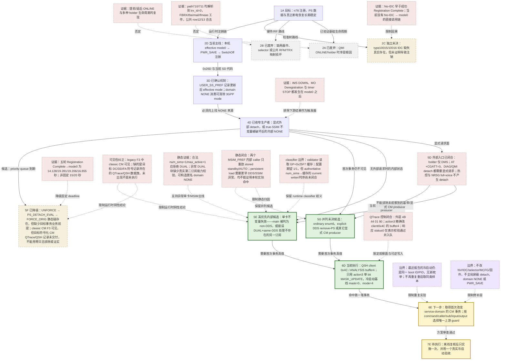

# E11D 射频修复路线图

```mermaid
flowchart TD
  Start["1A 目标：n78 注册、PS 数据与真正断电恢复长期稳定"]

  Holder["2A 已废弃：QMI ONLINE/holder 时序是根因"]
  Hardware["2B 已废弃：缺两器件、selector 或公共 RFM/TRX 映射损坏"]
  IDC["2C 独立未决：type10015/10016 IDC 缺失真实存在，但未证明导致注销"]
  Lifecycle["2D 当前主线：本机 effective mode0 → PWR_SAVE → SwitchOff 注销"]

  DomainNone["3D 已确认机制：USER_SS_PREF 记录更新后 effective mode；domain NONE 消费可清除 3GPP mode"]
  Producers["4D 已收窄生产者：显式外部 detach，或 true-SSIM 不变量被破坏后的内部 NONE"]

  External["5D 外部入口已闭合：holder 仅 DMS；AT +CGATT=0、DIAG/QMI detach 都需要显式请求；热控与 NR5G full-voice 不产生 detach"]
  SsimViolation["5E 高优先内部候选：单卡不变量失效——main 被判为 non-DDS，或错误 DUAL+same-DDS 处理不存在的另一订阅"]
  Ordinary["5G 并列未决候选：ordinary enum6、explicit DDS remove-PS 或其它显式 CM producer"]
  OrigExpiry["5F 已降级：UNFORCE → PS_DETACH_EVAL → FORCE_ORIG 静态链存在，但缺少目标事务业务前提；classic CM F3 可见，但目标符号化 CM QTrace/QSH 记录未交付，不能用零日志排除或证实"]
  Capture["6D 当前执行：QSH client 0x4C / ANALYSIS buffer4；只用 action3 单 bit MASK_UPDATE，冷启动基线 mask=0、mode=4"]
  Next["6E 下一步：取得首次改变 service-domain 的 CM 事务；按 command/caller/sub/input/output 选择唯一上游 guard"]
  Verify["7E 待执行：离线复核后只实施一次，并用一个真实冷启动验收"]

  EvidenceA["证据：提前/延后 ONLINE 与多种 holder 生命周期均复现"]
  EvidenceB["证据：path710/711 均解析到 trx_id=0，FBRX/thermal/rfmeas 工作，公共 row12/13 合法"]
  EvidenceC["证据：No-IDC 早于成功 Registration Complete；当前没有 No-IDC → mode0 的直接调用链"]
  EvidenceD["证据：五轮 Registration Complete→mode0 为 14.128/19.281/19.206/16.855 秒；非固定 15/20 秒"]
  EvidenceE["证据：IMS DOWN、MO Deregistration 与 timer STOP 都发生在 mode0 之后"]
  EvidenceF["可见性纠正：legacy F3 中 classic CM 可见；缺的是目标 DC/DD/FA 符号记录所在的 QTrace/QSH 数据类，未出现不是未执行"]
  EvidenceJ["QTrace 控制闭合：外层 4B 44 01 90；action3 精确改 client0x4C 的 buffer4；响应 status0 仅表示校验通过并入队"]
  EvidenceG["静态证据：合法 num_sims=1/max_active=1 应拒绝 DUAL；异常 DUAL 块缺少真实第二订阅能力校验，可构造匿名 domain NONE"]
  EvidenceH["静态闭合：两个 MSIM_PREF 内部 caller 只重放 stored standby/AUTO；persistent load 需要更早 DDS/SSIM 异常，均不能证明本轮实际命中"]
  EvidenceI["classifier 边界：validator 读取 GP+0x25F7 缓存；配置期望 1/1，但 authoritative num_sims→缓存的 current writer/时序尚未闭合"]
  ColdBoot["边界：最近报告的冷启动仍是同一 boot ID/PID，无新枚举；不再重复重启取同类样本"]
  Safety["边界：不改 NV/IDC/selector/MCFG/固件，不全局屏蔽 detach、domain NONE 或 PWR_SAVE"]

  Start -->|"已验证基础生命周期"| Holder
  Start -->|"硬件/RF 路线"| Hardware
  Start -->|"校准树路线"| IDC
  Start -->|"运行时注销链"| Lifecycle

  Lifecycle -->|"0x26D 与当前 SD 代码"| DomainNone
  DomainNone -->|"必须向上找 NONE 来源"| Producers
  Producers -->|"显式请求面"| External
  Producers -->|"无外部请求时的内部状态"| SsimViolation
  Producers -->|"首次事务仍不可见"| Ordinary
  Producers -->|"候选：priority queue 到期"| OrigExpiry
  External -->|"当前主机侧没有已知请求 producer"| SsimViolation
  External -->|"不能排除未观察到的基带/显式 CM producer"| Ordinary
  SsimViolation -->|"需要首次事务真值"| Capture
  Ordinary -->|"需要首次事务真值"| Capture
  Capture -->|"命中第一笔事务"| Next
  Next -->|"方案审查通过"| Verify

  EvidenceA -.->|"否定"| Holder
  EvidenceB -.->|"否定"| Hardware
  EvidenceC -.->|"限制因果"| IDC
  EvidenceD -.->|"降级固定 deadline"| OrigExpiry
  EvidenceE -.->|"排除下游结果作为触发器"| Producers
  EvidenceF -.->|"限制运行时阴性结论"| OrigExpiry
  EvidenceF -.->|"限制运行时阴性结论"| SsimViolation
  EvidenceG -.->|"支持异常单卡/MSIM主线"| SsimViolation
  EvidenceH -.->|"限制静态归因"| SsimViolation
  EvidenceH -.->|"保留并列候选"| Ordinary
  EvidenceI -.->|"保留 runtime classifier 歧义"| SsimViolation
  EvidenceJ -.->|"限定观察面与可逆写入"| Capture
  ColdBoot -.->|"限制重复实验"| Next
  Safety -.->|"限制修补层"| Next

  class SsimViolation current
  class Ordinary current
  class External evidence
  class Capture current
  class Next next
  class Verify next
  class Holder,Hardware abandoned
  class OrigExpiry,IDC paused
  class EvidenceA,EvidenceB,EvidenceC,EvidenceD,EvidenceE,EvidenceF,EvidenceG,EvidenceH,EvidenceI,EvidenceJ evidence
  class ColdBoot,Safety boundary
  classDef current fill:#dff3df,stroke:#3f7d3f,stroke-width:3px
  classDef next fill:#fff4cc,stroke:#a67c00,stroke-width:2px
  classDef abandoned fill:#f1f1f1,stroke:#888,stroke-dasharray:5 5
  classDef paused fill:#f6f0df,stroke:#9a7b32,stroke-dasharray:5 5
  classDef evidence fill:#f7e7e7,stroke:#a65a5a,stroke-dasharray:3 3
  classDef boundary fill:#eee7ff,stroke:#7354a8,stroke-dasharray:3 3
```
