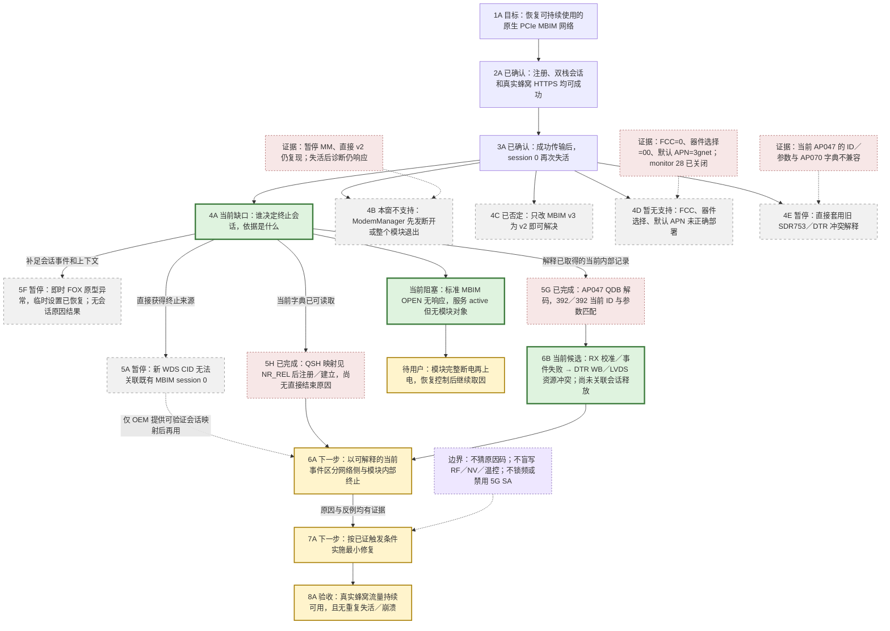

# 原生 PCIe MBIM 数据会话断开定位路线

```mermaid
flowchart TD
    A["1A 目标：恢复可持续使用的原生 PCIe MBIM 网络"]
    B["2A 已确认：注册、双栈会话和真实蜂窝 HTTPS 均可成功"]
    C["3A 已确认：成功传输后，session 0 再次失活"]
    D["4A 当前缺口：谁决定终止会话，依据是什么"]
    H["4B 本窗不支持：ModemManager 先发断开或整个模块退出"]
    V["4C 已否定：只改 MBIM v3 为 v2 即可解决"]
    P["4D 暂无支持：FCC、器件选择、默认 APN 未正确部署"]
    O["4E 暂停：直接套用旧 SDR753／DTR 冲突解释"]
    E1["证据：暂停 MM、直接 v2 仍复现；失活后诊断仍响应"]
    E2["证据：FCC=0、器件选择=00、默认 APN=3gnet；monitor 28 已关闭"]
    E3["证据：当前 AP047 的 ID／参数与 AP070 字典不兼容"]
    W["5A 暂停：新 WDS CID 无法关联既有 MBIM session 0"]
    T["5F 暂停：即时 FOX 原型异常，临时设置已恢复；无会话原因结果"]
    M["5H 已完成：QSH 映射见 NR_REL 后注册／建立，尚无直接结束原因"]
    K["当前阻塞：标准 MBIM OPEN 无响应，服务 active 但无模块对象"]
    COLD["待用户：模块完整断电再上电，恢复控制后继续取因"]
    Q["5G 已完成：AP047 QDB 解码，392／392 当前 ID 与参数匹配"]
    R["6B 当前候选：RX 校准／事件失败 → DTR WB／LVDS 资源冲突；尚未关联会话释放"]
    X["6A 下一步：以可解释的当前事件区分网络侧与模块内部终止"]
    F["7A 下一步：按已证触发条件实施最小修复"]
    Z["8A 验收：真实蜂窝流量持续可用，且无重复失活／崩溃"]
    N["边界：不猜原因码；不盲写 RF／NV／温控；不锁频或禁用 5G SA"]
    A --> B --> C --> D
    C --> H
    C --> V
    C --> P
    C --> O
    E1 -.-> H
    E2 -.-> P
    E3 -.-> O
    D -->|"直接获得终止来源"| W
    D -->|"补足会话事件和上下文"| T
    D -->|"当前字典已可读取"| M
    D --> K --> COLD
    D -->|"解释已取得的当前内部记录"| Q
    W -.->|"仅 OEM 提供可验证会话映射后再用"| X
    M --> X
    Q --> R --> X
    X -->|"原因与反例均有证据"| F --> Z
    N -.-> F
    class D,R,K current
    class M evidence
    class COLD next
    class Q evidence
    class X,F,Z next
    class H,V,P,O,W,T paused
    class E1,E2,E3 evidence
    class N boundary
    classDef current fill:#dff3df,stroke:#3f7d3f,stroke-width:3px
    classDef next fill:#fff4cc,stroke:#a67c00,stroke-width:2px
    classDef paused fill:#f1f1f1,stroke:#888,stroke-dasharray:5 5
    classDef evidence fill:#f7e7e7,stroke:#a65a5a,stroke-dasharray:3 3
    classDef boundary fill:#eee7ff,stroke:#7354a8,stroke-dasharray:3 3
```
